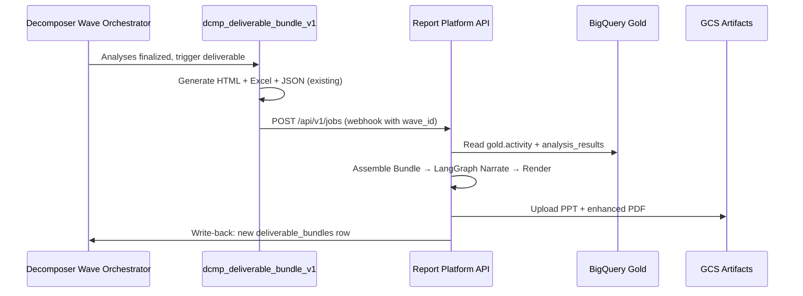
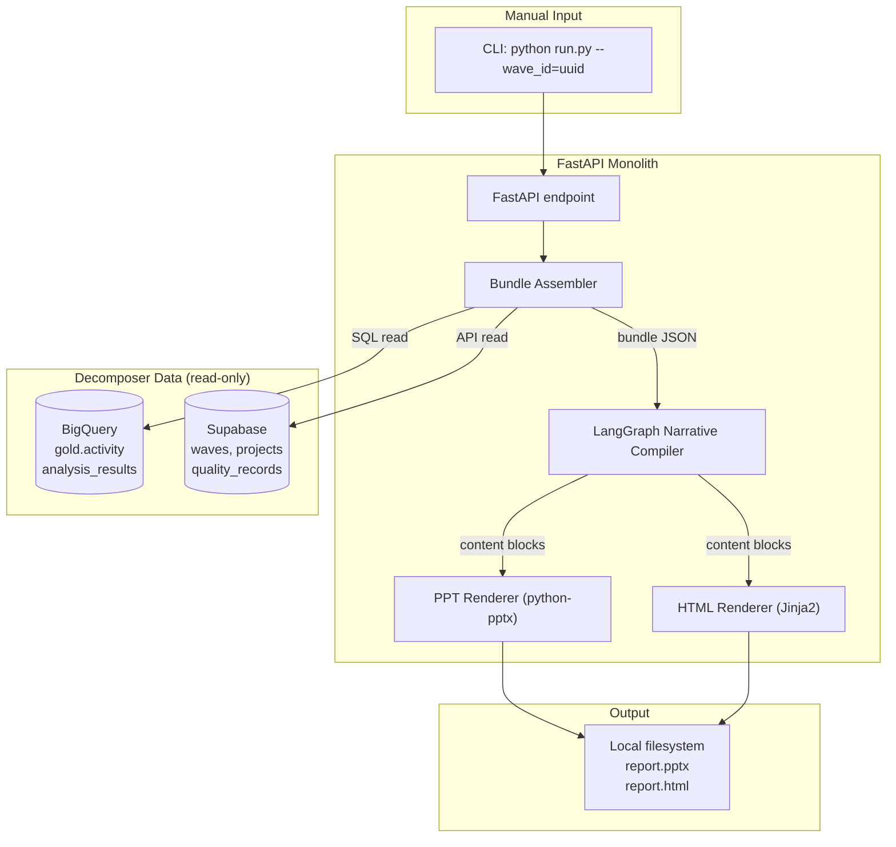
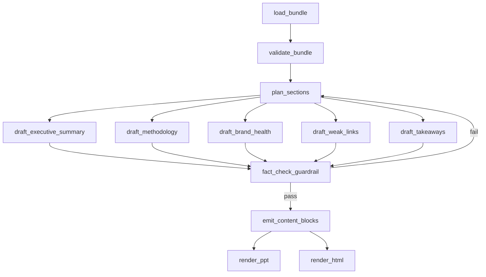
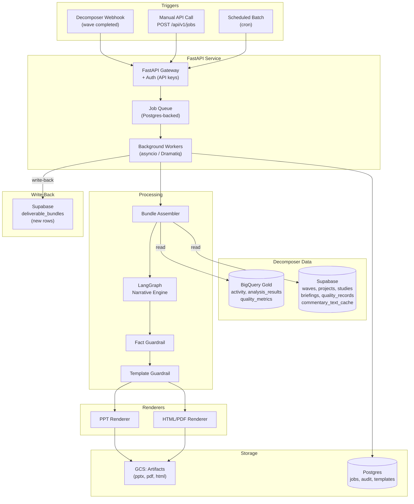
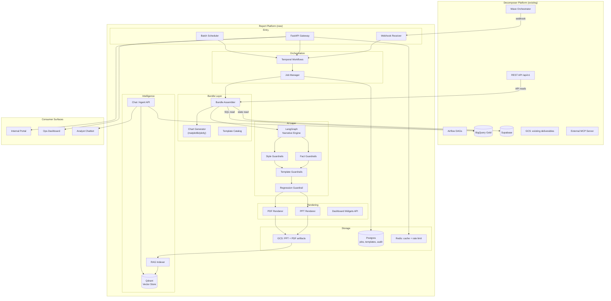
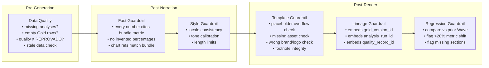

# Automated Report & PPT Platform — Updated Architecture

**Decision Record:**
- ✅ **No R analytics layer** — consume Decomposer Gold directly
- ✅ **Integration-first** — designed as a downstream consumer of the Decomposer pipeline from POC onward
- ✅ **Option (b) confirmed** — Python/Airflow stays the analytics engine; this system narrates + renders

---

## 1. Core Principle: The Report Platform is a Consumer, Not a Producer

```
Decomposer Pipeline (EXISTS)          Report Platform (NEW)
━━━━━━━━━━━━━━━━━━━━━━━━━━━━         ━━━━━━━━━━━━━━━━━━━━━
Scrape → Score → Quality → Analyze    Assemble → Narrate → Render
         ↓                                      ↑
    BigQuery Gold ──────────────────────────────┘
    Analysis Results ───────────────────────────┘
    Quality Records ────────────────────────────┘
```

The Decomposer Platform **owns the truth**. The Report Platform **shapes the truth into deliverables**. This is a strict consumer relationship — no data duplication, no recomputation.

---

## 2. Integration Points with Decomposer

The Report Platform connects to Decomposer at exactly **4 read points** and **1 write-back point**:

### Read Points (Report Platform pulls FROM Decomposer)

| Source | What | How |
|--------|------|-----|
| `decomposer_gold.activity` | Satisfaction indices per (brand × activity × segment) | BigQuery SQL read |
| `decomposer_gold.analysis_results` | Analyses 1–8 output (rankings, comparisons, breakdowns) | BigQuery SQL read |
| Supabase `quality_records` | Quality concept (OURO/PRATA/BRONZE) + briefing adherence | Supabase client read |
| Supabase `waves` + `projects` + `studies` + `briefings` | Wave metadata, brand hierarchy, period, client context | Supabase client read |

### Write-Back Point (Report Platform pushes TO Decomposer)

| Target | What | How |
|--------|------|-----|
| Supabase `deliverable_bundles` | New bundle row with GCS paths to PPT/PDF artifacts | Supabase service-role insert OR REST API call |

### Trigger Mechanism



> [!IMPORTANT]
> The Report Platform does NOT replace `dcmp_deliverable_bundle_v1`. It runs **alongside** it. B1 continues producing the existing HTML + Excel + JSON triple. The Report Platform produces **additional** artifacts (PPT, enhanced PDF) from the same source data. Both write to `deliverable_bundles` with different `bundle_type` values.

---

## 3. The Analysis Bundle Contract

Since we're consuming Decomposer's output, the bundle is an **assembly** of existing data, not a computation. The Bundle Assembler reads from BigQuery + Supabase and produces this contract:

### POC Bundle (minimal)

```json
{
  "bundle_id": "uuid",
  "wave_id": "uuid",
  "project_name": "Ceragem BR CVC 2025-Q4",
  "period": "2025-Q4",
  "brand_focus": "Ceragem",
  "brands": [
    {"id": "uuid", "name": "Ceragem", "tier": "focus"},
    {"id": "uuid", "name": "Competitor A", "tier": "primary"}
  ],
  "gold_activity": [
    {"brand": "Ceragem", "activity": "Waiting Time", "satisfaction_index": 61.2}
  ],
  "analyses": {
    "a1_industry_avg": {"result": {}},
    "a5_brand_strong": {"result": {}},
    "a6_brand_achilles": {"result": {}}
  },
  "quality": {
    "concept": "OURO",
    "briefing_adherence_pct": 94.2
  }
}
```

### MVP Bundle (add provenance + chart refs)

```json
{
  "...POC fields...": "...",
  "provenance": {
    "gold_activity_version_id": "uuid",
    "analysis_run_id": "uuid",
    "quality_record_id": "uuid",
    "scoring_run_id": "uuid",
    "assembled_at": "2026-04-24T16:00:00Z"
  },
  "charts": [
    {
      "chart_id": "cvc_curve_ceragem",
      "type": "cvc_curve",
      "data": {},
      "generated_png_uri": "gs://..."
    }
  ],
  "commentary": {
    "executive_summary": "...",
    "per_section": {}
  },
  "template": {
    "ppt_template_id": "cvc_v3_master",
    "locale": "pt-BR"
  }
}
```

### Final Product Bundle (add evidence + lineage + historical)

Adds `evidence_refs`, `prior_wave_comparison`, `study_dictionary_snapshot`, full `lineage` chain back to Bronze.

---

## 4. POC Architecture

**Goal:** Validate that Decomposer Gold → Bundle → LangGraph → PPT/HTML produces acceptable quality.

**Timeline:** 1-2 weeks

**Scope:** Single Wave, single client, manually triggered, local output.



### POC Service Structure (single `app/` directory)

```
automated-report-ppt-generation/
├── app/
│   ├── main.py                    # FastAPI app
│   ├── config.py                  # env vars (BQ project, Supabase URL)
│   ├── bundle/
│   │   ├── assembler.py           # reads BigQuery + Supabase → bundle dict
│   │   └── schema.py              # Pydantic models for bundle contract
│   ├── narrative/
│   │   ├── graph.py               # LangGraph graph definition
│   │   ├── nodes.py               # graph nodes (takeaways, sections, etc.)
│   │   └── prompts/               # prompt templates per section
│   ├── renderers/
│   │   ├── ppt.py                 # python-pptx renderer
│   │   └── html.py                # Jinja2 HTML renderer
│   └── templates/
│       ├── cvc_master.pptx        # PPT template with named placeholders
│       └── report_v1.html         # HTML/Jinja2 template
├── requirements.txt
├── .env.example
└── README.md
```

### POC Dependencies

```
fastapi
uvicorn
google-cloud-bigquery
supabase
langgraph
langchain-anthropic
python-pptx
jinja2
pydantic
```

### POC LangGraph Node Design



---

## 5. MVP Architecture

**Goal:** Production-ready pipeline that runs reliably, supports multiple clients, integrates with Decomposer's workflow.

**Timeline:** 1-2 months after POC validates quality

**Scope:** Webhook-triggered, multi-tenant, job queue, GCS storage, write-back to Decomposer.



### What MVP Adds Over POC

| Capability | POC | MVP |
|-----------|-----|-----|
| Trigger | CLI only | Webhook + API + Schedule |
| Job management | None | Postgres queue + status tracking |
| Multi-tenant | Single client | Tenant isolation via `study_id` |
| Template management | Hardcoded | Template registry in Postgres |
| Chart generation | None | matplotlib/plotly → PNG for PPT slides |
| Guardrails | Basic fact-check | Fact + template + data quality |
| Storage | Local filesystem | GCS with signed URLs |
| Write-back | None | Updates Decomposer's `deliverable_bundles` |
| Auth | None | API key auth (mirror Decomposer's `api_keys` pattern) |
| Retry | None | Failed jobs retry 3x with backoff |
| Observability | print() | Structured logging (Pino-compatible JSON) |

### MVP Database Schema (Postgres — report platform's own DB)

```sql
-- Job tracking
CREATE TABLE jobs (
    id UUID PRIMARY KEY DEFAULT gen_random_uuid(),
    wave_id UUID NOT NULL,
    study_id UUID NOT NULL,
    status TEXT NOT NULL CHECK (status IN ('queued','assembling','narrating','rendering','complete','failed')),
    bundle_json JSONB,
    output_artifacts JSONB,  -- {pptx_gcs_path, pdf_gcs_path, html_gcs_path}
    error_message TEXT,
    retry_count INT DEFAULT 0,
    created_at TIMESTAMPTZ DEFAULT now(),
    started_at TIMESTAMPTZ,
    completed_at TIMESTAMPTZ,
    provenance JSONB  -- gold_version_id, analysis_run_id, quality_record_id
);

-- Template registry
CREATE TABLE templates (
    id UUID PRIMARY KEY DEFAULT gen_random_uuid(),
    name TEXT NOT NULL,
    type TEXT NOT NULL CHECK (type IN ('pptx','html','pdf')),
    version INT NOT NULL,
    file_gcs_path TEXT NOT NULL,
    placeholder_map JSONB NOT NULL,  -- {slide_3_title: {max_chars: 40, type: "text"}}
    locale TEXT DEFAULT 'pt-BR',
    is_active BOOLEAN DEFAULT true,
    created_at TIMESTAMPTZ DEFAULT now()
);

-- Audit trail
CREATE TABLE audit_log (
    id UUID PRIMARY KEY DEFAULT gen_random_uuid(),
    job_id UUID REFERENCES jobs(id),
    action TEXT NOT NULL,
    details JSONB,
    created_at TIMESTAMPTZ DEFAULT now()
);
```

---

## 6. Final Product Architecture

**Goal:** Full-featured multi-product platform with RAG, chatbot, batch operations, and self-serve portal.

**Timeline:** Month 3-6



### What Final Product Adds Over MVP

| Capability | MVP | Final Product |
|-----------|-----|---------------|
| Orchestration | Postgres queue + Dramatiq | Temporal workflows |
| Chart generation | Basic matplotlib | Branded chart engine with style packs |
| RAG | None | Index final artifacts into Qdrant |
| Chatbot | None | 4 modes: Analyst, Client Q&A, Ops, Template |
| Batch | Single job | Fan-out 50 reports, retry individual failures |
| Templates | Static registry | Version-controlled with A/B testing |
| Regression check | None | Compare against prior Wave output |
| Dashboard API | None | Widget endpoints for portal embedding |
| Caching | None | Redis for LLM response + chart caching |
| Human approval | None | Optional review gate before publish |

---

## 7. Guardrails Framework (Updated)



---

## 8. Recommended Build Path

### Phase 1 — POC (Weeks 1-2)
- [ ] FastAPI app with `/api/v1/jobs` endpoint
- [ ] Bundle Assembler reading BigQuery Gold + Supabase
- [ ] LangGraph graph: load → plan → draft sections → fact-check → emit
- [ ] PPT renderer with single template (Ceragem CVC deck)
- [ ] HTML renderer with Jinja2 template
- [ ] Manual trigger via CLI
- [ ] **Validation gate:** show output to stakeholders, iterate on prompt quality

### Phase 2 — MVP (Weeks 3-8)
- [ ] Webhook integration with Decomposer (trigger on deliverable_bundle complete)
- [ ] Postgres job queue with status tracking
- [ ] Template registry (multiple PPT/HTML templates)
- [ ] Chart generation (matplotlib → PNG for slide insertion)
- [ ] Fact + Template guardrails
- [ ] GCS storage for output artifacts
- [ ] Write-back to Decomposer's `deliverable_bundles`
- [ ] API key auth (same pattern as Decomposer B2)
- [ ] Retry logic (3x with exponential backoff)
- [ ] Structured logging

### Phase 3 — Production (Weeks 9-16)
- [ ] Temporal for workflow orchestration
- [ ] Batch processing (50 reports/run)
- [ ] RAG indexing (Qdrant) over final artifacts
- [ ] Chatbot API (Analyst Copilot mode first)
- [ ] Regression guardrail (cross-Wave comparison)
- [ ] Redis caching for LLM responses
- [ ] Internal ops dashboard
- [ ] Human-in-the-loop approval gate (optional per template)

### Phase 4 — Platform (Weeks 17+)
- [ ] All 4 chatbot modes
- [ ] Brand/style packs per client
- [ ] Template A/B testing
- [ ] Client portal for download + Q&A
- [ ] Dashboard widget API
- [ ] Multi-locale support (hook into Decomposer's `studies.locale`)

---

## 9. Stack Summary

| Layer | POC | MVP | Final |
|-------|-----|-----|-------|
| **API** | FastAPI | FastAPI | FastAPI |
| **Orchestration** | asyncio | Dramatiq + Postgres | Temporal |
| **AI** | LangGraph + Anthropic | LangGraph + Anthropic | LangGraph + Anthropic |
| **PPT** | python-pptx | python-pptx | python-pptx |
| **HTML/PDF** | Jinja2 | Jinja2 + WeasyPrint | Jinja2 + WeasyPrint |
| **Charts** | — | matplotlib | matplotlib + branded engine |
| **Data Source** | BigQuery + Supabase | BigQuery + Supabase | BigQuery + Supabase |
| **Storage** | Local FS | GCS | GCS |
| **DB** | — | Postgres | Postgres |
| **Cache** | — | — | Redis |
| **Vector** | — | — | Qdrant |
| **Chat** | — | — | FastAPI + LangGraph |
