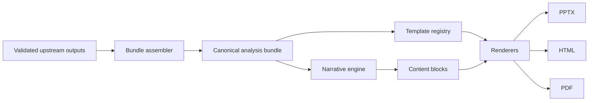

# Automated Report & PPT Generation

The annoying part of analytics work is often the last mile. The analysis is done, the numbers are solid, and someone still has to turn all of it into a deck, a report, and a PDF that another human can actually use.

That is what this project is for.

An upstream analytics workflow does the heavy lifting first: it gathers the source data, runs the analysis, and produces structured results. This service takes those finished outputs and turns them into client-facing deliverables.

```text
validated inputs  ->  analysis bundle  ->  narrative  ->  PPT / HTML / PDF
```

It is deliberately not a second analytics engine. The facts should already be settled before they arrive here. This app is about assembling them cleanly, explaining them well, and putting them into the right format.

## What it does

- Builds one analysis bundle from completed upstream results
- Writes report sections such as executive summary, methodology, brand health, weak links, and takeaways
- Renders the same story into PowerPoint, HTML, and PDF
- Supports multiple languages with locale files plus LLM-generated narrative
- Keeps data, wording, and visual templates separate so each can change without dragging the others around

A simple rule runs through the repo: **compute once, narrate many times**. A slide headline and a long-form report paragraph may read differently, but they should still come from the same source metrics.

## Why this matters

Most reporting workflows do not break because the analysis is weak. They slow down because the final mile is still manual: someone copies numbers into slides, rewrites the same conclusions in three formats, checks that every deck says the same thing, and repeats the whole ritual for the next client or market.

That work is slow, expensive, and surprisingly easy to get subtly wrong.

This project turns reporting into a repeatable system instead of a recurring scramble. Once a clean analytics bundle exists, the service can reuse the same truth across formats, keep narrative grounded in approved inputs, and give teams more time to improve the insight rather than reassemble the packaging.

## How it fits into a pipeline

This service is designed for the downstream part of the workflow: the point where the analysis is already done, and the remaining work is to explain it, format it, and ship it in a form people can use.

```text
Upstream workflow
  ingest -> process -> analyze
                   |
                   v
Automated Report Platform
  assemble -> narrate -> render
```

That boundary is intentional. Upstream systems own the calculations. This project owns the presentation layer.

## Architecture at a glance



The bundle is the center of gravity. It keeps the renderers aligned, lets narrative change without changing the data contract, and makes it possible to produce different deliverables from the same approved source.

## Where the project is today

The repo is still early, but the demo path works end to end. The API can:

- list available templates
- inspect PowerPoint placeholders
- create a report job in one request
- create one multilingual batch with child jobs per language
- generate HTML, PPTX, and PDF artifacts
- run with real LLM copy or deterministic fallback copy when you just need a reliable rehearsal
- expose structured batch and child-job logs for debugging

If you want the exact demo flow, start with `docs/demo-dry-run.md`.

## Run it locally

```bash
python -m venv .venv
source .venv/bin/activate
pip install -r requirements.txt
cp .env.example .env
uvicorn app.main:app --reload
```

Then check the service:

```bash
curl http://127.0.0.1:8000/health
```

For a first run, use the fallback path so you can test rendering before worrying about LLM credentials:

```bash
curl -X POST http://127.0.0.1:8000/api/v1/jobs \
  -H 'Content-Type: application/json' \
  -d '{
    "wave_id": "demo-wave",
    "language": "en-US",
    "template_id": "demo_master",
    "use_llm": false,
    "include_pdf": true
  }'
```

Outputs land in `artifacts/`.

For a multilingual request, use the batch endpoint so one parent ID groups all
language-specific children:

```bash
curl -X POST http://127.0.0.1:8000/api/v1/batches \
  -H 'Content-Type: application/json' \
  -d '{
    "wave_id": "demo-wave",
    "languages": ["en-US", "pt-BR"],
    "template_id": "client_cvc_master",
    "use_llm": true,
    "require_llm": true,
    "include_pdf": true
  }'
```

Structured JSONL logs land in `logs/`, and can also be queried through the API:

```bash
curl http://127.0.0.1:8000/api/v1/batches/<batch_id>/logs
curl http://127.0.0.1:8000/api/v1/jobs/<job_id>/logs
```

## Templates

PowerPoint masters live under `templates/`. The renderer looks for named placeholders such as:

- `exec_summary`
- `methodology`
- `brand_health`
- `weak_links`
- `takeaways`

Add a master deck, restart the API, and inspect it with:

```bash
curl http://127.0.0.1:8000/api/v1/templates
curl http://127.0.0.1:8000/api/v1/templates/<template_id>/inspect
```

One practical detail: `.pptx` files are ignored by default. That keeps large client decks out of source control, but it also means you need to provide local master files yourself unless you decide to version a demo deck on purpose.

## Repo map

```text
app/                  API, bundle assembly, narrative, and renderers
locales/              static labels for supported languages
templates/            template schemas and local PowerPoint masters
docs/                 demo notes and supporting docs
```

## The principles behind it

- Let the LLM explain the data, not invent it.
- Use one bundle as the source for every output format.
- Let designers change the look of a deck without making engineers rewrite business logic.
- If a number cannot be traced back to approved input data, it does not belong in the report.

## What comes next

The next real work is production hardening: queued jobs, write-back into upstream delivery records, stronger guardrails, richer chart generation, and better provenance across every artifact.

For now, the project already proves the important bit: once the analytics are sound, one pipeline can turn them into a usable story instead of three hand-built deliverables.
