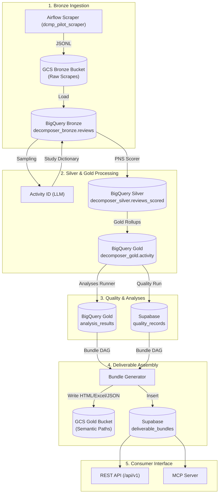
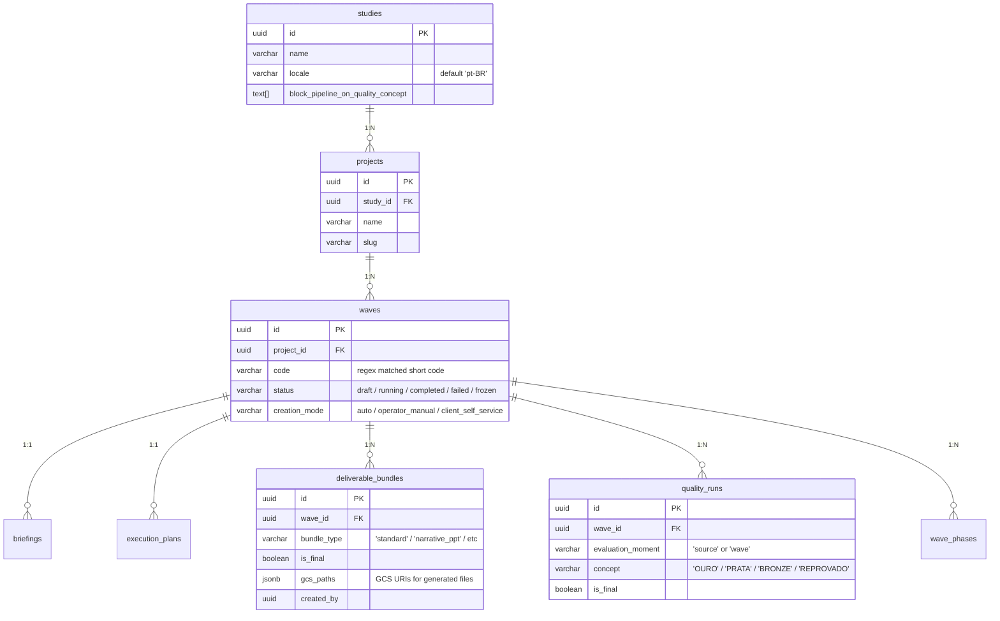

# Decomposer Platform — Handoff & Integration Report for Downstream Agents

This document serves as a comprehensive system map and schema contract for the **Decomposer Platform**. It is structured specifically for consumption by an autonomous agent developing a downstream system (such as the *Automated Report & PPT Platform*) that reads pipeline outputs or writes back deliverable bundles.

---

## 1. System Overview

The Decomposer Platform is an end-to-end data ingestion, mapping, scoring, analysis, and delivery orchestration system for customer review and survey data.



---

## 2. Project Scope & Roadmap State
As of **May 2026**, the platform is in its **MVP Stage** (Reviews-only pipeline operational). The remote branch (`origin/main`) is fully updated with the following core architectural milestones:

1. **Auto-Mode Wave Ingestion (B4/F5/F8):** Programmatic ingestion pipeline. From minimal company inputs, the platform automatically resolves the brand, fetches competitor datasets, starts scraping, and cascades execution.
2. **Deterministic GCS Storage (F16):** Fully migrated to the **Modelo B-v2 Semantic Paths** format. Object storage paths are strictly generated via hierarchical slugs + short-UUIDs (e.g. `industry-slug__shortid/project-slug__shortid/...`).
3. **Soft Quality Gates (F13):** Data quality checks (OURO, PRATA, BRONZE) tag results with metadata but no longer hard-block downstream calculations or deliverable generation unless explicit blocking is configured per Study.
4. **Operator Surface Overhaul (F17):** Features a structured state-machine tracking mechanism (`wave_phases` table) to visualize exact progress of runs. UI and administrative endpoints are fully normalized to English.

---

## 3. Data Integration & Access Contracts

A downstream consumer system (such as the Report Generation Platform) connects to the Decomposer Platform through the following database and API interfaces:

### A. BigQuery Datasets (Read-Only)
The primary analytical outputs of the scoring and aggregation engines reside in BigQuery.

| Dataset & Table | Description | Cluster/Partition Keys | Key Columns |
| :--- | :--- | :--- | :--- |
| **`decomposer_gold.activity`** | Satisfaction indices aggregated by brand, segment, and macro-activity. | Clustered: `study_id, brand_id` | `study_id` (UUID), `brand_id` (UUID), `segment_id` (UUID), `activity_code` (VARCHAR), `satisfaction_index` (NUMERIC) |
| **`decomposer_gold.analysis_results`** | Outputs of Analyses 1–8 (e.g. brand rankings, link deviations, Achilles heel highlights). | Partitioned: `DATE(computed_at)` | `wave_id` (UUID), `analysis_type` (VARCHAR: `a1`..`a8`), `result` (JSONB polymorphic blob), `parameters_used` (JSONB) |
| **`decomposer_gold.quality_metrics`** | Detailed rollup metrics of validation and quality checks. | Clustered: `wave_id` | `wave_id` (UUID), `brand_id` (UUID), `metric_name` (VARCHAR), `metric_value` (NUMERIC) |

---

### B. Supabase PostgreSQL Tables (Read & Write-Back)
For transaction metadata and pipeline execution status.



#### Read Access Contract
* **Quality Records (`quality_runs`):** Read the final `concept` and validation score. If `concept = 'REPROVADO'`, do not ingest unless study parameters permit.
* **Metadata & Context (`studies`, `projects`, `waves`, `briefings`):** Pull metadata like language/locale configuration (`studies.locale`), brand assignments, target sample counts, and wave execution modes.

#### Write-Back Access Contract
* **`deliverable_bundles`:** Insert a record once a deliverable (like a PPT slide deck or an enhanced PDF report) is generated.
  ```sql
  INSERT INTO public.deliverable_bundles (
      wave_id,
      bundle_type,
      is_final,
      gcs_paths,
      created_by
  ) VALUES (
      'target-wave-uuid',
      'narrative_ppt', -- or custom type identifier
      true,
      '{"pptx": "gs://bucket/path/report.pptx", "pdf": "gs://bucket/path/report.pdf"}'::jsonb,
      '00000000-0000-0000-0000-000000000000' -- Sentinel operator UUID or active user UUID
  );
  ```

---

### C. GCS Storage Layout: "Modelo B-v2" Semantic Paths (Read/Write)
The platform enforces a standardized directory mapping ruleset across GCS buckets. Downstream tools must look up artifacts at paths computed as:

```
gs://<bucket-name>/data/projects/<industry-slug>__<ind-id>/<project-slug>__<proj-id>/waves/<wave-code>__<wave-id>/<phase-slug>/
```

#### Hierarchy Components:
1. **`<industry-slug>__<ind-id>`**: Industry slug (from DB) + first 8 characters of Industry UUID.
2. **`<project-slug>__<proj-id>`**: Project slug (from DB) + first 8 characters of Project UUID.
3. **`<wave-code>__<wave-id>`**: Wave code (from DB, e.g. `W2026-Q1`) + first 8 characters of Wave UUID.
4. **`<phase-slug>`**: Folder representing the execution phase (e.g. `raw`, `silver`, `gold`, `deliverables`).

#### Pre-defined Artifact Types (Canonical Vocabulary):
Any file uploaded inside a phase folder must match the `dcmp_<artifact_type>.<extension>` vocabulary (e.g., `dcmp_analysis_results.json`, `dcmp_deliverable_excel.xlsx`).

---

### D. Model Context Protocol (MCP) Interface
For downstream LLM agents, the Decomposer Platform exposes a Model Context Protocol server. This allows agents to fetch context dynamically rather than running direct queries:

1. **`decomposer.get_wave(wave_id: string)`**: Returns the current status, briefing details, and metadata.
2. **`decomposer.get_deliverables(wave_id: string)`**: Returns registered deliverable bundles.
3. **`decomposer.get_analyses(wave_id: string)`**: Fetches final Analysis 1–8 JSON blobs.
4. **`decomposer.get_gold_activity(wave_id: string)`**: Retrieves satisfaction scores.
5. **`decomposer.get_quality(wave_id: string)`**: Fetches quality verification records.

---

## 4. Integration Blueprint for Report Platforms

For an external AI agent building a narration or PPT generation system, implement the following orchestration workflow:

```
                  ┌──────────────────────────────┐
                  │   Decomposer Platform Event  │
                  └──────────────┬───────────────┘
                                 │
                                 ▼ (Webhook: Wave Complete / Deliverable Created)
                  ┌──────────────────────────────┐
                  │ Fetch Wave Metadata via MCP  │
                  │   decomposer.get_wave()      │
                  └──────────────┬───────────────┘
                                 │
                                 ▼
                  ┌──────────────────────────────┐
                  │ Fetch Analyses 1-8 Output    │
                  │   decomposer.get_analyses()  │
                  └──────────────┬───────────────┘
                                 │
                                 ▼
                  ┌──────────────────────────────┐
                  │ Compile Narration (LLM/RAG)  │
                  └──────────────┬───────────────┘
                                 │
                                 ▼
                  ┌──────────────────────────────┐
                  │ Render Artifacts (PPT/PDF)   │
                  └──────────────┬───────────────┘
                                 │
                                 ▼
                  ┌──────────────────────────────┐
                  │ Upload to GCS Semantic Path  │
                  │   (Modelo B-v2 formatting)   │
                  └──────────────┬───────────────┘
                                 │
                                 ▼
                  ┌──────────────────────────────┐
                  │ Write-back to Supabase       │
                  │   deliverable_bundles        │
                  └──────────────────────────────┘
```

> [!NOTE]
> Ensure that all textual generations respect the `studies.locale` parameter. If `locale = 'pt-BR'`, generate all narrations in Portuguese; if `en-US`, generate in English.

---

## 5. Active Pipeline Version Index
If you need to query or verify DAG runs on Cloud Composer (Airflow), the current canonical versions deployed on the staging environment are:

* **Orchestrator:** `dcmp_wave_orchestrator_v16`
* **Scraper:** `dcmp_pilot_scraper_v9`
* **Activity Identification:** `dcmp_activity_mapper_v7`
* **PNS Scorer:** `dcmp_pns_scorer_v7`
* **Source Quality:** `dcmp_source_quality_v3`
* **Wave Quality:** `dcmp_wave_quality_v3`
* **Analyses Runner:** `dcmp_analyses_runner_v5`
* **Deliverable Bundle:** `dcmp_deliverable_bundle_v10`
* **Manual Upload:** `dcmp_manual_upload_v3`
